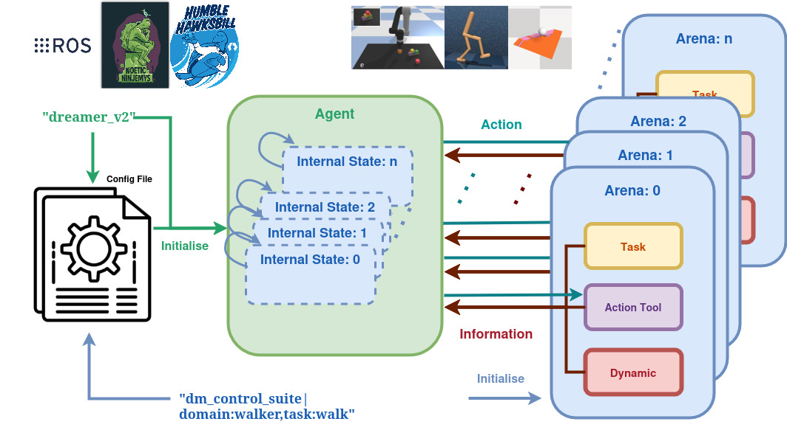

<h1>  Agent-Arena (v0): A Simple Framework for Experimenting Control Algorithms on Benchmark Environments </h1>

This project is mainly authored by **Halid Abdulrahim Kadi** and supervised by **Dr Kasim Terzić** at the *Univiersity of St Andrews, UK*.

[Website]() /  [ArXiv]() [Coming Soon]





## Table of Contents

- [I. Prerequisites](#prerequsites)
- [II. Simulation Setup](#simulation)
- [III. Train and Run PlaNet-ClothPick](#train-planet)
- [VI. Replicate Other Results](#other-results)
- [V. Demonstration](#demo)

## I. Prerequsites

Please make sure you have GPU driver installed in your operating system before preceding the set-up instructions. This project works in Linux environment, and it has not been tested on other operating systems. Known operating systems that works are:

* Ubuntu 20.04.6 LTS
* Ubuntu 22.04.3 LTS

Then, download and install `anaconda3` right under your home directory regarding your operating system version by following this [tutorial](https://docs.anaconda.com/free/anaconda/install/linux/).

Please do not try to run the project on CPU unless for testing purpose, because it will take ages to train and run. This project does not provide functionality to run a single model on multiple different GPUs, but you can run multiple models on different GPUs by assigning associate device name in the `yaml` files.

## II. Arena: Softgym Simulation Setup

The current repository produces the policies and environment wrappers on the `SoftGym` cloth-manipulation benchmark environment. We suggest readers download [our modfied version](https://github.com/halid1020/softgym/tree/master) of the simulation environment for setting up our `agent-areana` framework successfully.

Please follow the [tutorial ](https://github.com/halid1020/softgym/blob/master/README.md)to setup the simulation environment. We want to restate that the docker provided by the [original SoftGym](https://github.com/Xingyu-Lin/softgym) (which is also used by this project) is only employed to compile the simulation environment. The running and calling the environment's functionalities should be done outside the docker, or in another docker if you setup your experiment environment in a remote machine. After installing and compiling our version of the `SoftGym`, please get out of the docker. Here, we assume you have setup the simulation and downloaded corresponding data files of initial states for running the environments successfully.

## III. Agent Setup

Before starting this step, please make sure the current repository is parallel with the softgym repository you just setup. You do not need docker at this stage, unless you want to build your own docker environment in a remote machine. Here, we assume you are right under the `Agent-Arena` directory, now please follow the following command to finish the setup:

```
conda env create -f environment.yml

conda activate agent-arena-v0

# Change following line to fit your own GPU setting
conda install pytorch torchvision torchaudio pytorch-cuda=11.7 -c pytorch -c nvidia
conda install -c conda-forge diffusers 

```

Note that we separate out the installation of `Pytorch` from the environment yaml file to prevent installing wrong cuda and torch versions for your GPU setting, so please change that line for serving your own configuration. However, if you install the latest Nvidia driver on the machine, the provided command usually should work. Please open an interpreter to test if pytorch can detect GPU and load tensors and conduction calculations on the GPU before preceding the next step.

Note that if you want to remove the environment

```
conda remove -n agent-arena-v0 --all  
```

## VI. Test Agent-Arena

Every time you open a new terminal, please make sure run the command right under the `agent-arena`'s root directory.

```
. ./setup.sh
```

Right under the repo's root directory to link the corresponding libraries from the simulation and initiate the conda environment.

```
python test_arena.py

```

You should see the program print the basic configuration of the environments with the 20 steps output of the actions and evaluation looks like this,  and the evaluation metrics should get better:

```
Initialising Environment openAI-gym|domain:pushT
action space Box(0.0, 512.0, (2,), float64)
save video True
MoviePy - Building file ./tmp/manupilation_-1/performance_visualisation/episode_0.gif with imageio.
```

You can also enbale GUI display by adding `--disp` argument to the running command.

**Ryan Hayward** partially contributed to the `README.md` of the forked `softgym` repository that works align with this framework.

**Jose Alex Chandy** participated in the development of `environment.yml` file in the `ros1-integration` repository.
