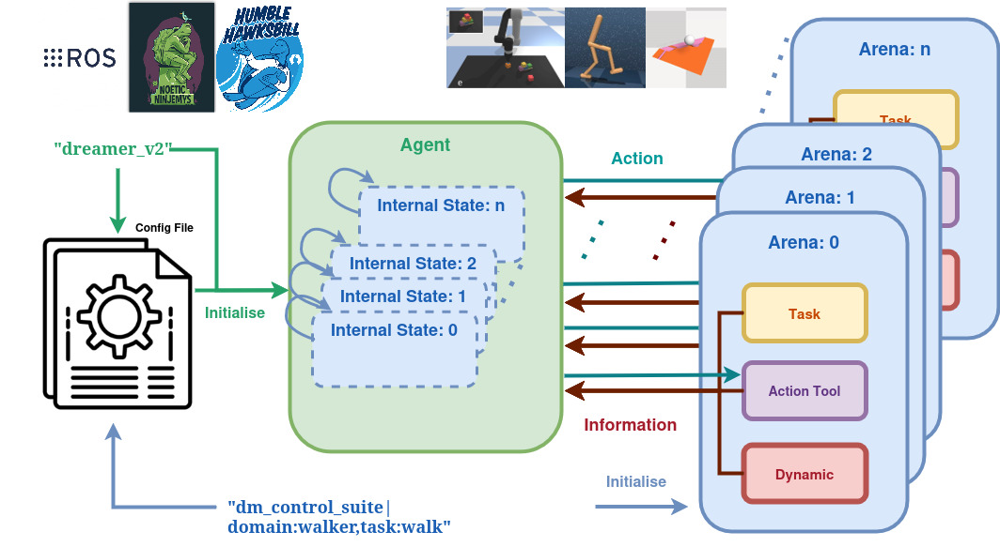

# Actoris Harena: A Simple Framework for Experimenting Control Algorithms on Benchmark Environments

**Authors:** Halid Abdulrahim Kadi (Lead), Dr Kasim Terzić (PhD Supervisor), and Dr John Oyekan (Postdoc Advisor)

*University of St Andrews, UK* and *University of York, UK*

> **Note:** Formerly known as **Agent Arena**, this project has been rebranded to **Actoris Harena** (Latin for "The Actor's Arena") to avoid naming conflicts.

[](https://doi.org/10.5281/zenodo.14876793)
[](https://arxiv.org/abs/2504.06468)



**⚠️ For ROS integration, please refer to the specific ROS branches.**

---

## Table of Contents

- [I. Prerequisites](#i-prerequisites)
- [II. Installation](#ii-installation)
- [III. Environment Setup](#iii-environment-setup)
- [IV. Testing](#iv-testing)
- [V. Documentation & Tutorials](#v-documentation--tutorials)
- [VI. Acknowledgements](#vi-acknowledgements)

---

## I. Prerequisites

Before proceeding, ensure your operating system has the appropriate GPU drivers installed. This project is designed for **Linux** environments and has been validated on the following distributions:

* Ubuntu 20.04.5 LTS
* Ubuntu 22.04.3 LTS
* Ubuntu 24.04.2 LTS

**Hardware Note:** Training and running models on a CPU is strictly **not recommended** due to significant performance limitations. While the framework does not currently support multi-GPU distribution for a single model, you can run parallel experiments on different GPUs by assigning specific device names in the configuration `yaml` files.

**Software:** Ensure [Anaconda3](https://docs.anaconda.com/free/anaconda/install/linux/) is installed in your home directory.

## II. Installation

We recommend using a fresh virtual environment to manage dependencies. Assume you are in the `actoris_harena` root directory:

1.  **Create and activate the environment:**
    ```bash
    conda create --name actoris-harena python=3.10
    conda activate actoris-harena
    ```

2.  **Install the package:**
    * *Option A (Standard + PyTorch):*
        ```bash
        pip install -e ".[torch]"
        ```
    * *Option B (Minimal - No PyTorch):*
        ```bash
        pip install -e .
        ```

*(To remove the environment later, use: `conda remove -n actoris-harena --all`)*

3. **Test the package**
For testing the installation of the package and the envrionmental variables, please run 
```bash
    python -c "import actoris_harena; import os; print(os.environ.get('RAVENS_ASSETS_DIR'))"
```

## III. Environment Setup

### A. SoftGym Simulation
To reproduce our policies and environment wrappers for the `SoftGym` cloth-manipulation benchmark, please use our modified simulation version.

1.  Download our modified SoftGym: [GitHub Link](https://github.com/halid1020/softgym/tree/py3.10).
2.  Follow the [SoftGym setup tutorial](https://github.com/halid1020/softgym/blob/py3.10/README.md).
    * **Note:** The Docker container provided by the original SoftGym is used *only* for compiling the simulation environment.
    * Running experiments should be done **outside** the Docker container (or in a separate container if using a remote machine).
3.  Ensure you have downloaded the corresponding initial state data files.

### B. Custom Benchmark Environments
For other benchmark environments, please follow their respective installation instructions. You must provide an **Adapter Class** that wraps the third-party environment to fit the `Arena` interface.

## IV. Testing

To verify your installation, navigate to the test directory and run the arena test script:

```bash
cd test
python test_arena.py